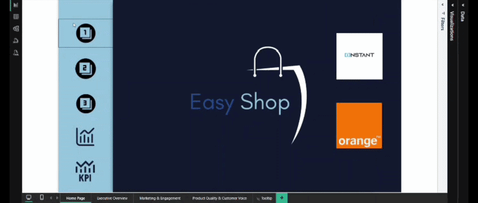
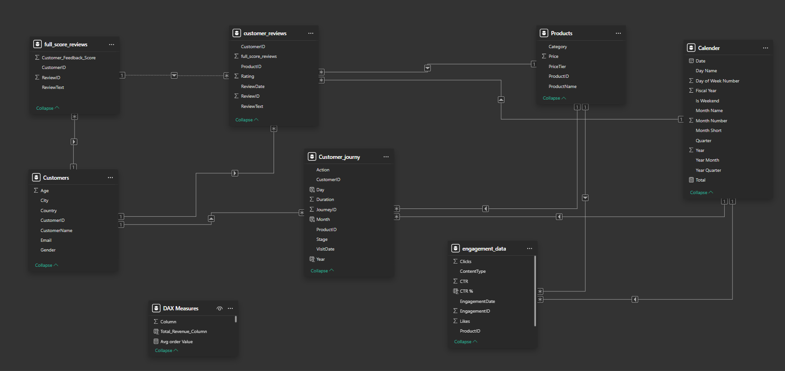
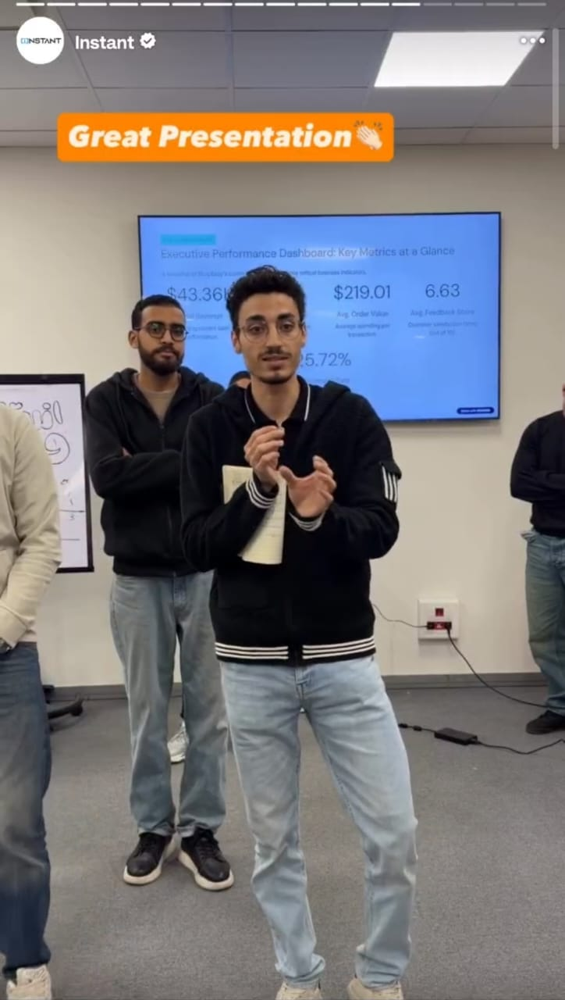
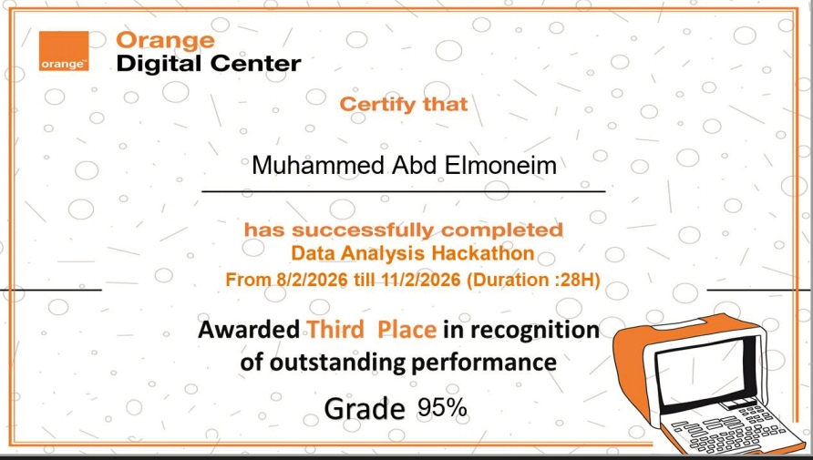

# 🛒 ShopEasy – Marketing Analytics – Hackathon Project🏆

<div align="center">


**🏆 Orange Digital Center – Marketing Analytics Hackathon | Top 3 out of ~30 Teams**

*A full end-to-end data analysis project: from a raw legacy .bak database to actionable business insights and an AI-powered sentiment analysis bonus.*

</div>

<p align="center">
  
</p>

## 📌 Executive Summary

This project simulates a real-world marketing analytics engagement where raw, inconsistent source data was transformed into a clean analytical layer using SQL Server Nested CTEs, modeled in Power BI, and used to generate KPI-driven business recommendations.

### Key Outcomes
- 🥉 Ranked **Top 3 out of ~30 teams** in the hackathon
- Built an end-to-end analytics workflow from raw backup database to executive dashboard
- Designed reusable KPI framework using SQL + DAX
- Added bonus sentiment analysis layer using Python (1,363 reviews scored)
- Delivered business recommendations tied to conversion, engagement, and ROI performance

<p align="center">
  
</p>

## 📈 Results Snapshot

| KPI | Value |
|---|---|
| 🔄 Conversion Rate | **9.57%** |
| 💰 Average Order Value (AOV) | **219.01** |
| 📣 Engagement Rate | **25.72%** |
| ⚠️ Drop-Off Percentage | **15.21%** |
| ⭐ Customer Feedback Score | **3.69 / 5** |
| 👁️ Total Views | **8M** |
| 💵 Total Revenue | **43.36K** |
| 🛒 Total Purchases | **198** |
| 📝 Reviews Analyzed (Python) | **1,363** |
| 🏆 Hackathon Result | **Top 3 / ~30 Teams** |

<p align="center">
  
</p>

## 📊 Project Dashboard Demo

> Interactive dashboard visualizing conversion funnels, marketing ROI, and customer sentiment.

<!-- Action Buttons -->
[](https://app.powerbi.com/view?r=eyJrIjoiYmZmOTIyYWUtMzZlYy00MTI2LWJiNTEtYWI5Mjc0MzM1MjZkIiwidCI6ImNmNzIyMWNkLTNiYzYtNDEwMS04NzYyLTU0ZjQ0ZjNiYzg5YSIsImMiOjl9&embedImagePlaceholder=true&pageName=6fda6007dac558d0e56e)



<p align="center">
  
</p>

### 📋 Key Insights Covered:
* **Executive Overview:** Conversion Rate, AOV, and Drop-Off analysis.
* **Marketing & Engagement:** CTR performance and campaign ROI.
* **Customer Voice:** VADER sentiment scores and geographic distribution.


<p align="center">
  
</p>

## 📌 Business Problem

**ShopEasy**, an online retail business, was struggling with three critical issues reported by three different managers:

| Stakeholder | Problem |
|---|---|
| 🎯 **Jane Doe** – Marketing Manager | Increased marketing spend with **low ROI** and **reduced engagement** |
| 👥 **John Smith** – Customer Experience Manager | Drop in **customer satisfaction** and unclear sentiment from reviews |
| 📊 Sales Direction | **Low conversion rates** despite campaign activity |

Our task: Act as a Data Analyst team — identify root causes, clean the data, build KPIs, and present insights with business recommendations.

<p align="center">
  
</p>

## 🗂️ Project Structure

```
shopeasy-marketing-analytics/
│
├── 📄 README.md
├── 📄 .gitignore
│
├── 📁 01_problem_statement/
│   └── DA_Marketing_Project.pdf          ← Original hackathon brief
│
├── 📁 02_data_cleaning/                  ← SQL Server Nested CTEs
│   ├── README.md                         ← Cleaning strategy explained
│   ├── customers.sql
│   ├── customer_journey.sql
│   ├── customer_reviews.sql
│   └── engagement_data.sql
│
├── 📁 03_sentiment_analysis/
│   ├── sentiment_analysis.py             ← VADER-based scoring (0–10)
│   ├── requirements.txt
│   └── full_score_reviews.xlsx           ← Output used in Power BI
│
├── 📁 04_powerbi/
│   ├── hakathon_dataa.pbix               ← Full dashboard + DAX measures
│   └── dax_measures.md                   ← All measures documented
│
├── 📁 05_screenshots/
│   ├── data_model.png
│   └── Dashboard.gif
│   ├── Home Page.png
│   ├── Excecutive Overview.png
│   └── Marketing & Engagement.png
│   └── Product Quality & Customer Voice.png
│
└── 📁 06_docs/
    ├── challenges_and_decisions.md       ← Key decisions & lessons learned
    └── data_dictionary.md                ← Column definitions & business logic
```

<p align="center">
  
</p>

## 🔄 Project Workflow

```
Understand Problem  →  Explore & Restore DB  →  Data Cleaning (SQL CTEs)
        ↓
  Power BI Import Mode  →  Data Modeling  →  DAX Measures
        ↓
   EDA & Insights  →  Sentiment Analysis (Python)  →  Dashboard  →  Presentation
```

<p align="center">
  
</p>

## 🛠️ Data Cleaning Approach (SQL Server)

The source database (`.bak`) had **significant quality issues**:

- ❌ Duplicate rows with no `PRIMARY KEY` constraints on several tables
- ❌ NULL values in critical columns (e.g., `Duration` in journey table)
- ❌ Gender mismatches — female customers recorded as `Male`
- ❌ Illogical values — ratings outside 1–5 range, future review dates
- ❌ Merged column (`ViewsClicksCombined`) needing splitting into `Views` and `Clicks`
- ❌ Inconsistent string casing and whitespace across categorical columns

### Why Nested CTEs?

> Rather than modifying the source data directly, we used **Nested CTEs as an abstraction layer** — each CTE handles one single responsibility, making the logic readable, maintainable, and easy to discuss as a team.

```sql
WITH RawCleaned AS (
    -- Step 1: Standardize casing, trim whitespace, cast types
),
HandledNulls AS (
    -- Step 2: Impute NULLs using PARTITION-based averages
),
Deduplicated AS (
    -- Step 3: ROW_NUMBER() to remove exact duplicates
)
SELECT ... FROM Deduplicated WHERE rn = 1;
```

These CTEs were then used directly inside **Power BI Import Mode** as the native query — so data arrives clean without ever touching the source.

<p align="center">
  
</p>

## 📊 Data Model (Power BI)



The model follows a **Star Schema** with:
- `Customers` (Dim)
- `Products` (Dim)
- `Calendar` (Dim — custom DAX table)
- `Customer_Journey` (Fact)
- `engagement_data` (Fact)
- `customer_reviews` (Fact)
- `full_score_reviews` (from Python sentiment output — joined on ReviewID)
- `DAX Measures` (isolated measures table for clean organization)

<p align="center">
  
</p>

## 📐 KPIs & DAX Measures

See full documentation → [`04_powerbi/dax_measures.md`](04_powerbi/dax_measures.md) 

| KPI | Description |
|---|---|
| **Conversion Rate** | % of journey visits that ended in PURCHASE |
| **Average Order Value (AOV)** | Revenue ÷ number of purchases |
| **Customer Engagement Rate** | (Likes + Clicks) ÷ Total Views |
| **CTR** | Clicks ÷ Views per campaign |
| **Customer Feedback Score** | Average rating from reviews |
| **Churn Indicator** | Customers with no visit in last 30 days |
| **Drop-off Rate** | DROP-OFF actions ÷ total visits |
| **Lost Deals at Checkout** | Drop-offs specifically at checkout stage |

<p align="center">
  
</p>

## 🤖 Sentiment Analysis (Bonus)

Used **NLTK VADER** to convert raw customer review text into a score from **1 to 10**:

```python
score = analyzer.polarity_scores(text)['compound']
rating = int(round(((score + 1) / 2) * 9 + 1))  # Maps [-1, 1] → [1, 10]
```

- Pulled 1,363 reviews directly from SQL Server via `SQLAlchemy`
- Output saved as `full_score_reviews.xlsx`
- Loaded into Power BI via Power Query and joined to the `customer_reviews` table on `ReviewID`
- Visualized in the dashboard as **Sentiment Overview**

<p align="center">
  
</p>

## 💡 Key Insights

> *(Based on EDA and dashboard analysis)*

1. **Conversion drop-off is highest at the Checkout stage** — indicating friction in the final purchase step, not product discovery.
2. **High views but low CTR on campaigns** — the problem is ad *content quality*, not budget allocation.
3. **Negative sentiment clusters around specific product categories** — surfaced through VADER scoring.
4. **Churned customers (>30 days inactive) represent a significant recoverable segment.**
5. **Engagement peaks on specific content types** — actionable signal for future campaign targeting.

<p align="center">
  
</p>

## ⚔️ Challenges & How We Solved Them

See full story → [`06_docs/challenges_and_decisions.md`](06_docs/challenges_and_decisions.md) .  [`06_docs/data_dictionary.md`](06_docs/data_dictionary.md) 

| Challenge | Solution |
|---|---|
| `.bak` file incompatible with MySQL | Migrated to SQL Server; then used CTEs to avoid re-cleaning |
| Lost ~1.5 days before realizing MySQL wouldn't work | Reused all cleaning logic as CTEs on SQL Server — faster second run |
| Instructor said "don't modify source data" | CTEs as abstraction layer — zero source modification |
| Time pressure vs. 30 other teams | Focused on depth of insights over breadth of visuals |

<p align="center">
  
</p>

## 🧰 Tech Stack

| Tool | Usage |
|---|---|
| **SQL Server** | Database restore, exploration, data cleaning via CTEs |
| **Power BI Desktop** | Data modeling, DAX measures, dashboard, Import Mode |
| **Power Query (M)** | Custom columns, conditional columns, data shaping |
| **DAX** | KPI measures, calculated columns, time intelligence |
| **Python 3** | Sentiment analysis (NLTK VADER + SQLAlchemy + pandas) |
| **Excel / XLSX** | Sentiment output format for Power BI ingestion |

<p align="center">
  
</p>

## 🚀 How to Run

### SQL Cleaning Scripts
1. Restore `MarketingAnalyticsProject.bak` to SQL Server
2. Run each `.sql` file in `02_data_cleaning/` to preview clean data
3. Use the final `SELECT` from each CTE as the Power BI import query

### Sentiment Analysis
```bash
pip install -r 03_sentiment_analysis/requirements.txt
# Update SERVER_NAME and DATABASE_NAME in sentiment_analysis.py
python 03_sentiment_analysis/sentiment_analysis.py
```

### Power BI Dashboard
1. Open `04_powerbi/hakathon_dataa.pbix` in Power BI Desktop
2. Update the SQL Server connection string to your local instance
3. Refresh data

<p align="center">
  
</p>

## 📈 Recommendations

- Address checkout-stage friction **before** increasing ad spend
- Invest in high-performing content formats (those with strong CTR signals)
- Turn 840 happy customers into promoters to fix the 48% traffic drop and replace dying long-form content with short-form videos. Maximize ROI : Shift budget to high-conversion products (15.46%)
- Replace failing long-form content with Short-form Video and prioritize Social Media to reverse the 57% view collapse.
- Optimize low-converting campaign creatives — the data shows a budget allocation problem, not a reach problem
- Launch churn-recovery campaigns targeting customers inactive for 30+ days
- Use sentiment clusters to prioritize which product categories need quality improvements first
  

<p align="center">
  
</p>

## 🥉 Hackathon Outcome

Recognized among the **Top 3 teams** out of approximately 30 in the Orange Digital Center Marketing Analytics Hackathon.

Key differentiators that contributed:
- Strong data cleaning architecture using Nested CTEs (non-destructive abstraction layer)
- KPI-driven business framing instead of chart-heavy reporting
- Sentiment analysis bonus built end-to-end in Python beyond core requirements
- Focus on root-cause recommendations, not only descriptive analytics
- Ability to explain every number and every decision under Q&A pressure

<p align="center">
  
</p>

## 👥 Team

**Orange Digital Center – iNSTANT Hackathon**
*Data Analysis Track | ~30 competing teams*
*🏆 M A A Z O Team* 

<p align="center">
  
</p>

## 🔎 Suggested GitHub Topics

```
sql-server  power-bi  data-analysis  marketing-analytics
dax  sentiment-analysis  business-intelligence  hackathon  nltk
```

<p align="center">
  
</p>

## 📜HACKATHON Certificate 🏅
```
 Orange Digital Center Egypt & Instant Software Solutions
```

<p align="center">
  
  
</p>

<p align="center">
  
</p>

## 📄 License

This project is open source under the [MIT License](LICENSE).
